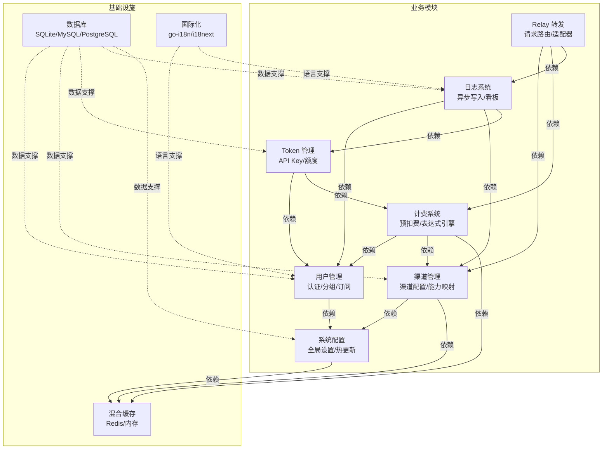

# Ocean API - 系统架构文档

## 1. 基础技术框架

### 1.1 技术栈选择

Ocean API 采用 Go 后端 + React 前端的双栈架构，后端以 Gin 框架为核心构建高性能 HTTP 网关，前端通过双版本（Default/Classic）并存策略兼顾现代化体验与向后兼容。数据库层通过 GORM 抽象实现 SQLite / MySQL / PostgreSQL 三库兼容，使系统可在零外部依赖下单二进制部署，亦可平滑扩展至生产级数据库集群。

#### 后端技术框架

- **框架**：Gin v1 (HTTP Web Framework)
- **语言**：Go 1.22+
- **ORM**：GORM v2
- **构建工具**：Go Modules
- **测试框架**：Go 标准库 testing
- **核心依赖**：expr-lang/expr（计费表达式引擎）、go-redis（缓存）、go-i18n（后端国际化）、golang-jwt/jwt（JWT 认证）

#### 前端技术框架

| 维度 | Default 前端 | Classic 前端 |
|------|-------------|-------------|
| **框架** | React 19.2 + TypeScript 5.9 | React 18.2 + TypeScript 4.4 |
| **UI 组件库** | Base UI + Radix UI + Hugeicons | Semi UI |
| **构建工具** | Rsbuild (RSPack) | Vite 5 |
| **路由** | TanStack Router（文件系统路由） | React Router 6 |
| **状态管理** | Zustand + TanStack Query | 未统一 |
| **样式** | Tailwind CSS 4 + clsx / class-variance-authority | Tailwind CSS 3 |
| **包管理器** | Bun | npm/yarn/pnpm |

#### 数据库选择

- **主数据库**：SQLite / MySQL >= 5.7.8 / PostgreSQL >= 9.6（三库同时兼容，运行时通过 GORM 自动适配）
- **字符集**：utf8mb4（MySQL）/ UTF8（PostgreSQL / SQLite）
- **排序规则**：unicode_ci（MySQL）/ 默认（PostgreSQL / SQLite）
- **日志数据库**：可选独立配置（LOG_SQL_DSN），支持读写分离

#### 中间件和基础设施

| 组件 | 推荐技术 | 用途 | 可选性 |
|------|----------|------|--------|
| 缓存 | Redis + 内存缓存（hot.HotCache） | 渠道信息、用户基本信息、计费表达式、系统配置缓存；Redis 不可用时自动降级至内存 | 可选 |
| 消息队列 | 无（采用 Go 协程异步处理） | 异步日志写入、后台任务（频道缓存同步、配置热更新、数据看板、频道自动测试、订阅配额重置） | 内置 |
| 对象存储 | MinIO（可选） | 文件存储服务对接 | 可选 |

#### 技术选型理由

- **Go + Gin**：AI API 网关需要高并发、低延迟的请求转发能力，Go 的 goroutine 模型和 Gin 的高性能路由匹配符合场景需求
- **GORM 多库兼容**：通过同一套 GORM 代码支持 SQLite（单二进制零依赖部署）、MySQL、PostgreSQL（生产环境），降低运维复杂度
- **React 19 + Rsbuild**：Default 前端选用 React 19 配合 Rsbuild 获得更快的构建速度和更优的 HMR 体验，TanStack Router 提供类型安全的文件系统路由
- **混合缓存**：Redis 优先 + 内存降级策略确保在缓存层不可用时系统仍可正常运行，符合零外部依赖可运行的设计目标

---

## 2. 模块划分和模块间依赖关系

### 2.1 系统模块分层架构

```
Router 层（路由层）
    ↓
Middleware 层（中间件层：CORS / Gzip / Auth / Distributor）
    ↓
Controller 层（控制器层：API Controller / Relay Handler）
    ↓
Service 层（业务逻辑层：格式转换 / 频道选择 / 计费会话）
    ↓
Model 层（数据访问层：GORM Entity + DAO）
    ↓
数据库层（SQLite / MySQL / PostgreSQL）
```

**分层职责**：
- **Router 层**：HTTP 路由注册与分发，按职责分为 API Router（业务管理）、Relay Router（AI 模型转发）、Video Router（视频处理）、Web Router（静态资源）、Dashboard Router（管理面板）
- **Middleware 层**：请求预处理链，包括 CORS、Gzip 解压、性能监控、认证（JWT/Session/WebAuthn/OAuth）、渠道分发器（Distributor，核心中间件）
- **Controller 层**：请求参数解析与响应封装，API 侧约 72 个控制器按功能模块划分，Relay 侧通过 RelayMode 分发到不同 Helper
- **Service 层**：核心业务逻辑，包括请求/响应格式转换（convert.go）、频道亲和性管理（channel_affinity.go）、计费会话管理（billing_session.go）、频道选择算法
- **Model 层**：数据实体定义与数据库访问，GORM 自动处理多数据库方言差异

### 2.2 业务模块划分

| 模块 | 职责范围 | 对应功能 | 依赖关系 |
|------|----------|----------|---------|
| **用户管理** | 用户注册/登录/权限/分组/订阅 | 用户体系、JWT/Passkey/OAuth 认证、分组隔离、订阅配额 | 依赖基础配置、日志 |
| **渠道管理** | AI Provider 渠道配置与能力声明 | 渠道增删改查、模型能力映射（Ability）、自动测试、状态监控 | 依赖基础配置、缓存 |
| **Token 管理** | API Key 生命周期与额度控制 | Key 创建/撤销/额度分配、IP 限制、模型访问权限 | 依赖用户管理、计费 |
| **Relay 转发** | AI 请求的统一接入与上游转发 | 请求路由、适配器工厂、格式转换、流式/非流式响应处理 | 依赖渠道管理、计费、日志 |
| **计费系统** | 多层级额度计算与预扣费 | 模型单价查询、分组倍率、表达式引擎、预扣费/结算、BillingSession | 依赖用户管理、渠道管理 |
| **日志系统** | 请求日志记录与查询分析 | 异步日志写入、日志数据库分离、用量统计、数据看板 | 依赖用户管理、渠道管理、Token 管理 |
| **系统配置** | 全局配置与运行时热更新 | 系统设置、模型定价、操作配置、性能调参、国际化 | 无前置依赖 |
| **OAuth 集成** | 第三方登录接入 | GitHub、Discord、OIDC 等 OAuth 2.0 流程 | 依赖用户管理 |

**模块说明**：
- **用户管理**：支持多租户隔离的分组（Group）机制，用户可通过钱包或订阅模式管理额度，VIP 用户享有信任额度跳过预扣费
- **渠道管理**：每个渠道绑定一个 AI Provider 类型和密钥，通过 Ability 表声明支持的模型列表，支持 auto 分组自动选择最优渠道
- **Relay 转发**：系统核心模块，通过适配器模式封装 40+ 上游 Provider 的 API 差异，对外暴露统一的 OpenAI 兼容接口
- **计费系统**：基于 expr-lang/expr 实现动态计费规则，支持变量（prompt/completion/cache tokens）和内置函数（tier、header、param 等），编译后的表达式缓存以提升性能
- **日志系统**：采用异步写入机制降低请求延迟，支持独立日志数据库配置，避免日志写入影响业务数据库性能

### 2.3 模块间依赖关系图



**依赖关系说明**：
- **Relay 转发** 依赖 渠道管理（获取渠道配置和密钥）、计费系统（预扣费/结算）、日志系统（请求记录）
- **计费系统** 依赖 用户管理（额度查询/扣减）、渠道管理（分组倍率/模型单价）
- **日志系统** 依赖 用户管理（用户维度统计）、渠道管理（渠道维度统计）、Token 管理（Key 维度统计）
- **系统配置** 为基础模块，无前置业务依赖，被用户管理、渠道管理等模块依赖
- **渠道管理** 和 **计费系统** 依赖 混合缓存 加速热点数据访问
- 模块间通过 Go 函数调用（同步）进行通信，异步场景（日志写入、后台任务）通过 goroutine 处理

### 2.4 模块间通信方式

| 场景 | 通信方式 | 说明 |
|------|----------|------|
| Controller 调用 Service | Go 函数调用 | 同步调用，同一进程内直接交互 |
| Service 调用 Model | GORM API | 通过 GORM 的 Create/Find/Where/Updates 等方法操作数据库 |
| Relay 请求处理 | 适配器接口调用 | 通过 Adaptor 接口生命周期方法（Init/GetRequestURL/SetupRequestHeader/ConvertRequest/DoRequest/DoResponse） |
| 异步日志写入 | Go 协程 + Channel | 请求响应返回后，异步将日志批量写入数据库，降低请求延迟 |
| 后台任务 | Go 协程 + time.Ticker | 频道缓存同步、配置热更新、数据看板刷新、频道自动测试、订阅配额重置等定时任务 |
| 缓存访问 | Redis 协议 / 内存 Map | 优先 Redis，不可用时降级至内存缓存，通过命名空间隔离不同数据类型 |

### 2.5 新增模块内部结构

本项目为已有完整架构的增量维护项目，当前无新增模块需求。现有模块的目录结构已在技术栈和分层架构章节中描述。

---

## 3. 本系统与外部系统的关联

### 3.1 本系统调用外部系统的接口（集成外部服务）

**定义**：本系统作为调用方，通过 HTTP RESTful API 或 SDK 调用第三方提供的 AI 服务接口。

#### 3.1.1 上游 AI Provider 集成

| 接口名称 | 用途 | 交互方式 | 数据流向 | 集成方式 |
|----------|------|----------|----------|----------|
| **OpenAI API** | GPT 系列模型调用 | HTTP RESTful + SSE 流式 | 请求：本系统 → OpenAI；响应：OpenAI → 本系统 → 客户端 | 适配器模式，统一转换为 OpenAI 格式 |
| **Anthropic Claude API** | Claude 系列模型调用 | HTTP RESTful + SSE 流式 | 请求：本系统 → Anthropic；响应：Anthropic → 本系统 → 客户端 | 适配器模式，请求/响应格式转换 |
| **Google Gemini API** | Gemini 系列模型调用 | HTTP RESTful + SSE 流式 | 请求：本系统 → Google；响应：Google → 本系统 → 客户端 | 适配器模式，支持 /v1beta 原生路径 |
| **Azure OpenAI API** | Azure 托管的 OpenAI 模型 | HTTP RESTful + SSE 流式 | 请求：本系统 → Azure；响应：Azure → 本系统 → 客户端 | 适配器模式，Azure 专用 URL 和认证头 |
| **AWS Bedrock API** | AWS 托管的基础模型 | HTTP RESTful + SDK | 请求：本系统 → AWS；响应：AWS → 本系统 → 客户端 | 适配器模式，AWS SigV4 签名 |
| **其他 Provider（37+）** | 各厂商模型调用 | HTTP RESTful | 请求：本系统 → Provider；响应：Provider → 本系统 → 客户端 | 适配器模式，各 Provider 独立实现 |

**已支持的 Provider 列表**：AI360、Ali（通义千问）、AWS Bedrock、Baidu（文心）、Claude（Anthropic）、Cloudflare、Cohere、Coze、DeepSeek、Dify、Gemini（Google）、Moonshot（月之暗面）、OpenAI（含 Azure）、OpenRouter、Perplexity、Replicate、SiliconFlow、Tencent（混元）、Volcengine（火山引擎）、XAI、Zhipu（智谱）等 40+ 家。

**使用场景**：
- **AI 对话与补全**：客户端通过 OpenAI 兼容格式请求，Distributor 选择渠道后由对应 Provider Adaptor 转发
- **嵌入向量（Embeddings）**：统一接口转发至各 Provider 的嵌入模型
- **图像生成与管理**：通过 ImageHelper 和对应 Adaptor 转发至支持图像的 Provider
- **音频处理**：通过 AudioHelper 转发至支持语音转文字/文字转语音的 Provider
- **实时通信（Realtime）**：通过 Relay Router 的 Realtime 路径转发至支持实时 API 的 Provider

**错误处理和重试机制**：
- 超时时间：根据 Provider 类型动态配置，通常 30s-120s
- 重试次数：支持渠道级别自动切换，单渠道失败后自动尝试同分组内其他渠道
- 失败降级：无全局降级，依赖渠道分组内的自动故障转移

#### 3.1.2 对象存储服务集成（可选）

| 接口名称 | 用途 | 交互方式 | 数据流向 | 集成方式 |
|----------|------|----------|----------|----------|
| **MinIO / S3 API** | 文件上传/下载/管理 | HTTP RESTful / SDK | 请求：本系统 → MinIO/S3；响应：MinIO/S3 → 本系统 | SDK 调用，配置 Endpoint 和密钥 |

**使用场景**：
- 文件上传后通过预签名 URL 提供给客户端或上游模型

**错误处理和重试机制**：
- 超时时间：30s
- 重试次数：3 次（指数退避）
- 失败降级：返回上传失败错误，不阻塞主流程

### 3.2 本系统提供给外部的接口（对外暴露服务接口）

**定义**：本系统作为提供方，向外部系统开放 HTTP RESTful API，供外部系统调用本系统的功能。

**对外暴露的接口分类**：

| 接口类别 | 路径前缀 | 说明 |
|----------|----------|------|
| **OpenAI 兼容 API** | `/v1/*` | 兼容 OpenAI 格式的 AI API，包括 chat/completions、embeddings、images、audio、rerank、realtime |
| **Gemini 原生 API** | `/v1beta/*` | Google Gemini 原生格式路由，供习惯 Gemini SDK 的客户端直接调用 |
| **管理后台 API** | `/api/*` | 系统管理接口，包括用户管理、渠道管理、Token 管理、日志查询、系统配置等 |
| **Midjourney 代理** | `/mj/*` | Midjourney 绘画服务代理路由 |
| **Suno 代理** | `/suno/*` | Suno 音乐生成服务代理路由 |

**使用场景**：
- 外部开发者或内部系统通过 OpenAI 兼容 API 调用聚合后的 AI 能力
- 管理后台通过 `/api/*` 进行系统运维和用户管理
- 特定场景（绘画、音乐）通过专用代理路由接入对应服务

**注意**：
- OpenAI 兼容 API 和管理后台 API 均通过 JWT / API Key 认证
- 渠道分发器（Distributor）在中间件层对 `/v1/*` 和 `/v1beta/*` 请求进行渠道选择和负载均衡
- 管理后台 API 需要额外的管理员权限校验

### 3.3 接口清单

| 外部系统 | 交互方式 | 集成方式 | 错误处理 |
|----------|----------|----------|----------|
| **OpenAI** | HTTP RESTful + SSE | 适配器模式，Bearer Token 认证 | 超时 60s，渠道内自动切换 |
| **Anthropic Claude** | HTTP RESTful + SSE | 适配器模式，x-api-key 认证 | 超时 60s，渠道内自动切换 |
| **Google Gemini** | HTTP RESTful + SSE | 适配器模式，API Key 认证 | 超时 60s，渠道内自动切换 |
| **Azure OpenAI** | HTTP RESTful + SSE | 适配器模式，API Key / AAD 认证 | 超时 60s，渠道内自动切换 |
| **AWS Bedrock** | HTTP RESTful + SDK | 适配器模式，SigV4 签名 | 超时 120s，渠道内自动切换 |
| **其他 AI Provider（35+）** | HTTP RESTful | 适配器模式，各 Provider 独立认证 | 超时按 Provider 配置，渠道内自动切换 |
| **MinIO / S3（可选）** | HTTP RESTful / SDK | SDK 调用 | 超时 30s，3 次重试 |

---

## 4. 架构约束

### 4.1 性能要求

#### 响应时间要求

| 场景 | 目标响应时间 | 说明 |
|------|-------------|------|
| **管理后台 API** | < 500ms | 用户管理、渠道查询、配置读取等常规 CRUD |
| **Relay 非流式请求** | < 5s（首 Token） | 取决于上游 Provider，本系统转发延迟 < 100ms |
| **Relay 流式请求（SSE）** | 实时推送 | 收到上游 SSE 事件后立即转发至客户端，无缓冲延迟 |
| **日志异步写入** | 不阻塞主响应 | 请求响应返回后后台异步完成日志写入 |

#### 并发量要求

| 场景 | 目标并发量 | 说明 |
|------|-------------|------|
| **Relay 请求处理** | 取决于上游配额和渠道配置 | Go goroutine 模型支持高并发 I/O，单节点可支撑数千并发连接 |
| **管理后台 API** | 中低并发 | 内部运维使用，非核心性能路径 |
| **WebSocket / Realtime** | 长连接保持 | 依赖上游 Provider 的并发连接限制 |

#### 数据量要求

| 场景 | 预估数据量 | 说明 |
|------|-----------|------|
| **请求日志** | 日增量取决于业务量 | 支持独立日志数据库分离，避免日志膨胀影响业务库 |
| **用户数据** | 万级至百万级 | 通过索引和缓存优化查询 |
| **渠道配置** | 百级 | 全量缓存于 Redis/内存，运行时无数据库查询 |

### 4.2 安全要求

#### 认证方式

- **方式**：多认证机制并存（JWT Token / Session / WebAuthn Passkeys / OAuth 2.0）
- **实现**：
  - JWT：golang-jwt/jwt，Token 包含用户 ID、过期时间
  - Session：基于 Cookie 的 Session 认证
  - WebAuthn：FIDO2 Passkeys 无密码认证
  - OAuth：GitHub、Discord、OIDC 等第三方登录
- **Token 有效期**：JWT 短期有效（可配置），支持刷新机制；Session 有效期由服务器控制
- **登录方式**：用户名密码、API Key、Passkeys、第三方 OAuth

#### 授权机制

- **方式**：基于分组（Group）的 RBAC + 模型级权限控制
- **实现**：
  - 用户归属于分组，分组决定可用的渠道集合和计费规则
  - Token 级别可配置模型访问白名单/黑名单
  - IP 白名单限制 Token 的使用来源
- **权限粒度**：用户级 → 分组级 → Token 级 → 模型级，四级粒度

#### 数据加密

- **传输加密**：HTTPS（TLS 1.2+）
- **存储加密**：数据库密码/密钥字段使用 AES 加密存储
- **密码加密**：用户密码使用 bcrypt 哈希存储

#### 敏感数据保护

- **字段脱敏**：API Key 在日志和前端列表中脱敏展示（仅显示前缀）
- **访问审计**：请求日志记录用户 ID、Token ID、渠道 ID、模型名称、IP 地址、请求时间、消耗额度
- **数据隔离**：分组机制实现多租户隔离，不同分组的渠道配置和计费规则互不可见

### 4.3 可扩展性要求

当前架构为单体部署模式，通过以下机制支持水平扩展：

- **应用部署**：无状态设计，多节点部署时仅需共享数据库和 Redis，即可通过负载均衡横向扩展
- **数据库扩展**：主数据库可通过 GORM 连接池配置优化并发访问；日志数据库支持独立部署和读写分离
- **缓存扩展**：Redis 集群模式支持缓存层横向扩展；单机部署时内存缓存自动兜底

### 4.4 技术约束

#### 必须使用的技术栈

- **后端框架**：Go 1.22+ + Gin
- **前端框架**：React 18/19 + TypeScript
- **数据库**：SQLite / MySQL >= 5.7.8 / PostgreSQL >= 9.6（代码必须同时兼容三者）
- **ORM**：GORM v2
- **缓存**：Redis（可选）+ 内存缓存
- **国际化**：后端 go-i18n，前端 i18next
- **JSON 处理**：必须使用 `common/json.go` 包装函数，禁止直接调用 `encoding/json`

#### 禁止的技术

- **数据库专有特性**：禁止在业务代码中使用 MySQL 专有函数（如 GROUP_CONCAT）、PostgreSQL 专有操作符（如 JSONB 操作符 @>）、SQLite 不支持的 ALTER COLUMN
- **直接 JSON 调用**：业务代码禁止直接导入或调用 `encoding/json` 进行 marshal/unmarshal
- **非指针请求字段**：Relay 请求 DTO 的可选标量字段禁止使用非指针标量 + omitempty，必须使用指针类型 + omitempty 以保留显式零值

#### 兼容性要求

- **浏览器**：现代浏览器（Chrome、Firefox、Safari、Edge 最新两个主版本）
- **移动端**：支持移动端浏览器访问管理后台，未提供原生 App
- **API 兼容性**：对外暴露的 `/v1/*` 接口保持与 OpenAI API 的格式兼容，`/v1beta/*` 保持与 Gemini API 的格式兼容

---

## 5. 附录

### 5.1 技术术语表

| 术语 | 说明 |
|------|------|
| **Relay** | AI 请求转发代理子系统，负责将统一格式的请求转换并分发到不同的上游 AI Provider |
| **Adaptor** | Provider 适配器，封装特定上游 Provider 的 API 差异，实现统一的请求/响应转换接口 |
| **Distributor** | 渠道分发中间件，从请求中提取模型名称，根据 Token 分组配置选择最优渠道 |
| **Channel Affinity** | 渠道亲和性，同一会话的多次请求优先路由到同一渠道，保持上下文一致性 |
| **Billing Expression** | 计费表达式，基于 expr-lang/expr 的动态定价规则，支持变量和内置函数 |
| **Billing Session** | 计费会话，记录一次请求的预扣费、实际消耗和结算差额 |

### 5.2 参考文档

- [CLAUDE.md](../../CLAUDE.md) — 项目级开发规范与架构概览
- [web/default/AGENTS.md](../../web/default/AGENTS.md) — Default 前端开发规范
- [pkg/billingexpr/expr.md](../../pkg/billingexpr/expr.md) — 计费表达式系统设计文档

### 5.3 变更记录

| 版本 | 日期 | 变更内容 | 作者 |
|------|------|---------|------|
| v1.0 | 2026-05-17 | 基于现有代码和架构分析，按标准模板格式重新组织架构文档 | Claude Code |

---

**文档版本**：v1.0
**创建日期**：2026-05-17
**最后更新**：2026-05-17
