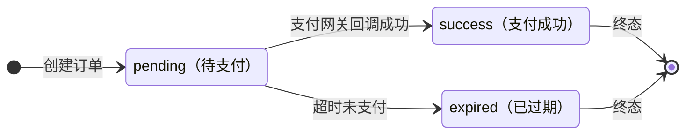
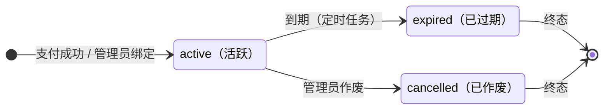

# 订阅套餐 功能需求规格说明书

## 文档信息

- 基线 Feature：无
- 变更组：无

---

# 功能需求规格说明书

## 1. 概述

### 1.1 功能背景

系统提供 AI API 网关服务，传统的按量付费（钱包充值）模式已无法满足需要固定额度、周期性计费的用户需求。订阅套餐功能为用户提供"固定周期 + 固定额度"的订阅制计费方式，与钱包按量付费并行运行，支持灵活的计费偏好和分组权限升级。

### 1.2 本功能业务目标

1. 提供订阅制计费能力，用户购买套餐后获得固定周期内的额度使用权
2. 支持多种支付网关（Stripe、Creem、易支付）完成订阅购买
3. 通过分组升降级机制，将套餐与模型访问权限绑定
4. 提供灵活的计费偏好，用户可自主选择订阅/钱包的扣费优先级
5. 实现自动化的订阅生命周期管理（过期、配额重置、分组回退）

---

## 2. 角色与权限矩阵

> **说明**：本章节整合所有权限信息，是权限控制的单一真实来源。

### 2.1 数据权限（行级访问控制）

| 角色 | 数据范围 | 说明 |
|------|---------|------|
| 管理员 | 全部套餐和全部用户订阅 | 可查看、创建、编辑、删除所有套餐；可为任意用户绑定/管理订阅 |
| 普通用户 | 仅自己的订阅和订单 | 只能查看自己的订阅状态、购买套餐、管理自己的计费偏好 |

**数据范围说明：**
- **仅自己**：只能访问 `user_id = 当前用户ID` 的订阅和订单数据
- **全部数据**：无过滤条件，可访问所有套餐和用户订阅记录

### 2.2 页面访问权限

| 页面名称 | 可访问角色 | 可操作角色 | 字段级权限 |
|---------|----------|----------|-----------|
| 管理员订阅管理页 | 管理员 | 管理员 | 无特殊限制 |
| 套餐创建/编辑抽屉 | 管理员 | 管理员 | 需支付合规确认后才能操作 |
| 启用/禁用确认弹窗 | 管理员 | 管理员 | 需支付合规确认后才能操作 |
| 用户订阅管理弹窗 | 管理员 | 管理员 | 添加订阅需支付合规确认 |
| 用户钱包页订阅区域 | 所有登录用户 | 所有登录用户 | 无 |
| 购买确认弹窗 | 所有登录用户 | 所有登录用户 | 无 |

**权限说明：**
- 管理员操作套餐前需完成支付合规确认，否则创建按钮不可用
- 用户只能查看和操作自己的订阅数据，无法访问其他用户的订阅信息
- 支付回调接口为公开接口，但需通过签名验证确保安全性

### 2.3 角色权限矩阵

#### 管理员

| 模块 | 功能 | API地址 | 权限 |
|------|------|---------|------|
| 套餐管理 | 查看套餐列表 | GET /api/subscription/admin/plans | √ |
| 套餐管理 | 创建套餐 | POST /api/subscription/admin/plans | √ |
| 套餐管理 | 编辑套餐 | PUT /api/subscription/admin/plans/:id | √ |
| 套餐管理 | 启用/禁用套餐 | PATCH /api/subscription/admin/plans/:id | √ |
| 用户订阅管理 | 查看用户订阅 | GET /api/subscription/admin/users/:id/subscriptions | √ |
| 用户订阅管理 | 为用户创建订阅 | POST /api/subscription/admin/users/:id/subscriptions | √ |
| 用户订阅管理 | 绑定订阅给用户 | POST /api/subscription/admin/bind | √ |
| 用户订阅管理 | 作废用户订阅 | POST /api/subscription/admin/user_subscriptions/:id/invalidate | √ |
| 用户订阅管理 | 删除用户订阅 | DELETE /api/subscription/admin/user_subscriptions/:id | √ |

#### 普通用户

| 模块 | 功能 | API地址 | 权限 |
|------|------|---------|------|
| 套餐浏览 | 查看可用套餐 | GET /api/subscription/plans | √ |
| 订阅管理 | 查看自己的订阅 | GET /api/subscription/self | √ |
| 订阅管理 | 更新计费偏好 | PUT /api/subscription/self/preference | √ |
| 支付购买 | Stripe支付 | POST /api/subscription/stripe/pay | √ |
| 支付购买 | Creem支付 | POST /api/subscription/creem/pay | √ |
| 支付购买 | 易支付 | POST /api/subscription/epay/pay | √ |

---

## 3. 页面与功能总览

### 3.1 页面清单

| 序号 | 页面名称 | 页面形式 | 职责说明 | 包含功能 |
|-----|---------|---------|---------|---------|
| 1 | 管理员订阅管理页 | 独立页面 | 管理套餐的全生命周期 | 套餐列表展示、创建、编辑、启用/禁用 |
| 2 | 套餐创建/编辑抽屉 | 抽屉 | 套餐表单编辑 | 套餐信息填写与保存 |
| 3 | 启用/禁用确认弹窗 | 弹窗对话框 | 确认套餐状态切换 | 确认启用或禁用操作 |
| 4 | 用户订阅管理弹窗 | 弹窗对话框 | 管理特定用户的订阅 | 为用户绑定订阅、查看订阅、作废/删除 |
| 5 | 用户钱包页订阅区域 | 内嵌组件 | 展示用户订阅状态和可购套餐 | 当前订阅展示、套餐浏览、计费偏好切换、购买 |
| 6 | 购买确认弹窗 | 弹窗对话框 | 确认购买并选择支付方式 | 套餐详情展示、支付方式选择、跳转支付 |

### 3.2 页面跳转流程

```
[管理员侧]
管理后台菜单 → 管理员订阅管理页 → 点击"创建套餐" → 套餐创建抽屉
                                  → 点击行操作"编辑" → 套餐编辑抽屉
                                  → 点击行操作"启用/禁用" → 启用/禁用确认弹窗

用户管理页 → 点击行操作"订阅" → 用户订阅管理弹窗 → 点击"添加订阅" → 选择套餐并确认

[用户侧]
钱包页 → 订阅区域 → 点击"立即订阅" → 购买确认弹窗 → 选择支付方式 → 跳转支付网关
                 → 切换计费偏好下拉 → 即时保存
```

**流程说明：**
1. 管理员通过后台菜单进入订阅管理页，可对套餐进行 CRUD 操作
2. 管理员在用户管理页可以为特定用户手动绑定/管理订阅
3. 用户在钱包页浏览可购套餐、查看当前订阅状态、切换计费偏好、发起购买
4. 购买流程通过支付网关完成，支付成功后回调自动激活订阅

---

## 4. 页面功能详细说明

### 4.1 页面 1：管理员订阅管理页

#### 4.1.1 页面概述

**页面形式：**独立页面

**页面职责：**管理员管理所有订阅套餐的核心入口。展示套餐列表，支持创建、编辑、启用/禁用操作。页面顶部有合规确认状态提示，未确认时创建按钮不可用。

#### 4.1.2 涉及字段

##### A. 显示字段

| 字段名称 | 字段类型 | 数据来源 | 获取时机 | 业务含义 |
|---------|---------|---------|---------|---------|
| ID | 标签 | 数据库 | 页面加载 | 套餐唯一标识 |
| 标题 | 标签 | 数据库 | 页面加载 | 套餐名称 |
| 副标题 | 标签 | 数据库 | 页面加载 | 套餐补充说明 |
| 价格 | 标签 | 数据库 | 页面加载 | 套餐价格，格式为"金额 货币" |
| 有效期 | 标签 | 计算 | 页面加载 | 由时长单位+时长数值计算显示，如"1个月"、"3天"、"自定义3600秒" |
| 配额重置 | 标签 | 数据库 | 页面加载 | 配额重置周期显示，如"每月重置"、"不重置" |
| 优先级 | 标签 | 数据库 | 页面加载 | 排序权重值 |
| 状态 | 标签 | 数据库 | 页面加载 | 启用/禁用状态标签 |
| 支付渠道 | 标签 | 数据库 | 页面加载 | 已配置的支付渠道信息（Stripe Price ID / Creem Product ID） |
| 总配额 | 标签 | 数据库 | 页面加载 | 套餐总额度，0表示无限制 |
| 升级组 | 标签 | 数据库 | 页面加载 | 购买后升级到的用户分组 |

#### 4.1.3 功能与按钮

**用户可操作功能：**

- **创建套餐**
  - 触发按钮："创建套餐"
  - 按钮级别：页面级
  - 按钮位置：页面顶部工具栏
  - 触发方式：点击按钮
  - 权限要求：管理员，且需完成支付合规确认
  - 加载状态：是
  - 功能说明：点击后打开套餐创建抽屉（4.2）

- **编辑套餐**
  - 触发按钮："编辑"
  - 按钮级别：行级
  - 按钮位置：行内操作列
  - 触发方式：点击按钮
  - 权限要求：管理员
  - 加载状态：是
  - 功能说明：点击后打开套餐编辑抽屉（4.2），预填当前套餐数据

- **启用/禁用套餐**
  - 触发按钮："启用"/"禁用"
  - 按钮级别：行级
  - 按钮位置：行内操作列
  - 触发方式：点击按钮
  - 权限要求：管理员，且需完成支付合规确认
  - 加载状态：是
  - 功能说明：点击后弹出确认对话框（4.3），确认后切换套餐的启用状态

#### 4.1.4 业务规则

- **规则1：支付合规锁定**
  - 规则描述：管理员未确认支付合规条款前，创建套餐按钮和启用/禁用按钮不可用
  - 触发条件：页面加载时检查合规确认状态
  - 约束说明：页面顶部显示合规确认状态提醒

- **规则2：套餐排序**
  - 规则描述：列表按 SortOrder 降序排列，相同 SortOrder 按 ID 降序
  - 触发条件：列表加载时
  - 约束说明：管理员可通过编辑调整 SortOrder，值越大越靠前

- **规则3：已绑定套餐的编辑限制**
  - 规则描述：套餐被用户购买后仍可编辑，但核心字段变更（额度、时长、价格）只影响新购买，不影响已有订阅
  - 触发条件：编辑已有关联订阅的套餐时
  - 约束说明：无前端限制，后端直接生效

#### 4.1.5 交互逻辑

- 页面加载时自动拉取所有套餐列表（含已禁用的）
- 合规未确认时，页面顶部显示警告提示条
- 列表支持排序和分页

---

### 4.2 页面 2：套餐创建/编辑抽屉

#### 4.2.1 页面概述

**页面形式：**抽屉（从右侧滑出）

**页面职责：**创建新套餐或编辑已有套餐的表单界面。包含基础信息、时长配置、配额重置、第三方支付配置等模块。

#### 4.2.2 涉及字段

| 字段名称 | 字段类型 | 数据来源 | 获取时机 | 校验规则 | 默认值 | 业务含义 |
|---------|---------|---------|---------|---------|--------|---------|
| 标题 | 文本 | 用户输入 | 实时输入 | 必填，最大128字符 | 无 | 套餐名称 |
| 副标题 | 文本 | 用户输入 | 实时输入 | 最大255字符 | 空 | 套餐补充描述 |
| 价格 | 数字 | 用户输入 | 实时输入 | 必填，≥0且≤9999，精确到小数点后6位 | 0 | 套餐售价 |
| 货币 | 选择 | 系统预设 | 页面加载 | 必填 | USD | 货币类型 |
| 时长单位 | 选择 | 系统预设 | 页面加载 | 必填，可选：year/month/day/hour/custom | month | 套餐有效期的单位 |
| 时长数值 | 数字 | 用户输入 | 实时输入 | 必填，≥1（custom时忽略） | 1 | 套餐有效期的数量 |
| 自定义秒数 | 数字 | 用户输入 | 实时输入 | 时长单位为custom时必填，≥1 | 0 | 自定义有效期的秒数 |
| 排序权重 | 数字 | 用户输入 | 实时输入 | ≥0 | 0 | 列表排序权重，值越大越靠前 |
| Stripe Price ID | 文本 | 用户输入 | 实时输入 | 最大128字符 | 空 | Stripe平台的定价ID |
| Creem Product ID | 文本 | 用户输入 | 实时输入 | 最大128字符 | 空 | Creem平台的产品ID |
| 每用户最大购买次数 | 数字 | 用户输入 | 实时输入 | ≥0，0表示无限制 | 0 | 单个用户可购买该套餐的最大次数 |
| 升级组 | 文本 | 用户输入 | 实时输入 | 最大64字符，需为系统已存在的有效分组名 | 空 | 购买后自动升级到的用户分组 |
| 总额度 | 数字 | 用户输入 | 实时输入 | ≥0，0表示无限制 | 0 | 套餐的额度总量 |
| 配额重置周期 | 选择 | 系统预设 | 页面加载 | 必填，可选：never/daily/weekly/monthly/custom | never | 额度重置的周期 |
| 自定义重置秒数 | 数字 | 用户输入 | 实时输入 | 重置周期为custom时必填，≥1 | 0 | 自定义重置周期的秒数 |
| 启用状态 | 开关 | 用户输入 | 实时输入 | 无 | 启用 | 套餐是否启用 |

#### 4.2.3 功能与按钮

**用户可操作功能：**

- **保存套餐**
  - 触发按钮："保存"/"更新"
  - 按钮级别：页面级
  - 按钮位置：抽屉底部
  - 触发方式：点击按钮
  - 权限要求：管理员
  - 加载状态：是
  - 功能说明：校验表单通过后提交创建或更新请求，成功后关闭抽屉并刷新列表

- **取消编辑**
  - 触发按钮："取消"
  - 按钮级别：页面级
  - 按钮位置：抽屉底部
  - 触发方式：点击按钮
  - 权限要求：管理员
  - 加载状态：否
  - 功能说明：关闭抽屉并丢弃已填内容

#### 4.2.4 业务规则

- **规则1：时长配置联动**
  - 规则描述：当时长单位选择 custom 时，显示"自定义秒数"字段并必填；选择其他单位时显示"时长数值"字段
  - 触发条件：时长单位变更时
  - 约束说明：前端联动显示/隐藏

- **规则2：配额重置联动**
  - 规则描述：当配额重置周期选择 custom 时，显示"自定义重置秒数"字段并必填
  - 触发条件：重置周期变更时
  - 约束说明：前端联动显示/隐藏

- **规则3：升级分组校验**
  - 规则描述：填写的升级组名称需为系统已存在的有效分组，否则保存时报错
  - 触发条件：保存时
  - 约束说明：后端校验

- **规则4：时长单位为 custom 时忽略时长数值**
  - 规则描述：时长单位为 custom 时使用自定义秒数计算有效期，时长数值字段被忽略
  - 触发条件：保存时
  - 约束说明：后端处理

#### 4.2.5 交互逻辑

- 创建模式和编辑模式共用同一抽屉组件，编辑模式预填已有数据
- 时长单位选择 custom 时，隐藏时长数值字段，显示自定义秒数字段
- 配额重置周期选择 custom 时，显示自定义重置秒数字段

---

### 4.3 页面 3：启用/禁用确认弹窗

#### 4.3.1 页面概述

**页面形式：**弹窗对话框

**页面职责：**确认套餐的启用或禁用状态切换操作。

#### 4.3.2 功能与按钮

**用户可操作功能：**

- **确认切换状态**
  - 触发按钮："确认"
  - 按钮级别：页面级
  - 按钮位置：弹窗底部
  - 触发方式：点击按钮
  - 权限要求：管理员，且需完成支付合规确认
  - 加载状态：是
  - 功能说明：确认后调用 PATCH 接口切换套餐状态，成功后关闭弹窗并刷新列表

- **取消操作**
  - 触发按钮："取消"
  - 按钮级别：页面级
  - 按钮位置：弹窗底部
  - 触发方式：点击按钮
  - 加载状态：否
  - 功能说明：关闭弹窗，不执行任何操作

#### 4.3.3 交互逻辑

- 弹窗内容展示当前套餐标题和即将切换的状态
- 禁用操作不要求二次确认以外的额外校验

---

### 4.4 页面 4：用户订阅管理弹窗

#### 4.4.1 页面概述

**页面形式：**弹窗对话框

**页面职责：**管理员管理特定用户的订阅实例。可查看用户所有订阅（含历史），手动为用户绑定新订阅，以及作废或删除订阅。

#### 4.4.2 涉及字段

##### A. 显示字段（订阅列表）

| 字段名称 | 字段类型 | 数据来源 | 获取时机 | 业务含义 |
|---------|---------|---------|---------|---------|
| 套餐名称 | 标签 | 关联查询 | 页面加载 | 用户购买的套餐标题 |
| 总额度 | 标签 | 数据库 | 页面加载 | 订阅的总额度 |
| 已用额度 | 标签 | 数据库 | 页面加载 | 已消耗的额度 |
| 开始时间 | 标签 | 数据库 | 页面加载 | 订阅生效时间 |
| 结束时间 | 标签 | 数据库 | 页面加载 | 订阅到期时间 |
| 状态 | 标签 | 数据库 | 页面加载 | active/expired/cancelled |
| 来源 | 标签 | 数据库 | 页面加载 | order（支付购买）/admin（管理员绑定） |
| 升级组 | 标签 | 数据库 | 页面加载 | 当前生效的升级分组 |

##### B. 编辑字段（添加订阅）

| 字段名称 | 字段类型 | 数据来源 | 获取时机 | 校验规则 | 默认值 | 业务含义 |
|---------|---------|---------|---------|---------|--------|---------|
| 选择套餐 | 下拉 | 系统预设（已启用套餐） | 页面加载 | 必填 | 无 | 要绑定的套餐 |

#### 4.4.3 功能与按钮

**用户可操作功能：**

- **添加订阅**
  - 触发按钮："添加订阅"
  - 按钮级别：页面级
  - 按钮位置：弹窗顶部
  - 触发方式：点击按钮
  - 权限要求：管理员，且需完成支付合规确认
  - 加载状态：是
  - 功能说明：选择套餐后直接为用户创建订阅实例，来源标记为 admin，无需支付

- **作废订阅**
  - 触发按钮："作废"
  - 按钮级别：行级
  - 按钮位置：行内操作列
  - 触发方式：点击按钮
  - 权限要求：管理员
  - 加载状态：是
  - 功能说明：将活跃订阅的状态改为 cancelled，触发分组降级回退逻辑

- **删除订阅**
  - 触发按钮："删除"
  - 按钮级别：行级
  - 按钮位置：行内操作列
  - 触发方式：点击按钮
  - 权限要求：管理员
  - 加载状态：是
  - 功能说明：二次确认后删除订阅记录，活跃订阅需先作废才能删除

#### 4.4.4 业务规则

- **规则1：管理员绑定跳过支付**
  - 规则描述：管理员为用户绑定订阅时直接创建订阅实例，无需经过支付流程
  - 触发条件：管理员点击"添加订阅"
  - 约束说明：订阅来源标记为 admin

- **规则2：作废触发分组回退**
  - 规则描述：作废活跃订阅时，如果该订阅有升级组且用户的当前分组等于升级组，自动回退到订阅前的原始分组
  - 触发条件：作废活跃订阅
  - 约束说明：仅当用户的当前分组与订阅的升级组匹配时才执行回退

- **规则3：活跃订阅才能作废**
  - 规则描述：只有状态为 active 的订阅才能执行作废操作
  - 触发条件：点击作废按钮时
  - 约束说明：expired/cancelled 状态的订阅不显示作废按钮

#### 4.4.5 交互逻辑

- 弹窗打开时加载目标用户的所有订阅记录，包含 active、expired、cancelled 状态
- 套餐下拉列表仅展示已启用的套餐

---

### 4.5 页面 5：用户钱包页订阅区域

#### 4.5.1 页面概述

**页面形式：**内嵌组件（嵌入在钱包页面中）

**页面职责：**用户查看当前订阅状态、浏览可购套餐、切换计费偏好、发起购买。这是普通用户与订阅系统交互的唯一入口。

#### 4.5.2 涉及字段

##### A. 当前订阅状态展示

| 字段名称 | 字段类型 | 数据来源 | 获取时机 | 业务含义 |
|---------|---------|---------|---------|---------|
| 当前活跃订阅数 | 标签 | 数据库 | 页面加载 | 用户当前有效的订阅数量 |
| 剩余天数 | 标签 | 计算 | 页面加载 | 最近到期订阅的剩余天数 |
| 额度使用进度 | 进度条 | 计算 | 页面加载 | 已用额度/总额度的百分比 |

##### B. 套餐卡片展示字段

| 字段名称 | 字段类型 | 数据来源 | 获取时机 | 业务含义 |
|---------|---------|---------|---------|---------|
| 套餐标题 | 标签 | 数据库 | 页面加载 | 套餐名称 |
| 套餐副标题 | 标签 | 数据库 | 页面加载 | 套餐补充说明 |
| 价格 | 标签 | 数据库 | 页面加载 | "金额 货币" 格式 |
| 有效期 | 标签 | 计算 | 页面加载 | 如"1个月"、"30天" |
| 总额度 | 标签 | 数据库 | 页面加载 | 套餐额度总量 |
| 升级组 | 标签 | 数据库 | 页面加载 | 购买后升级到的分组名称 |

##### C. 计费偏好设置

| 字段名称 | 字段类型 | 数据来源 | 获取时机 | 校验规则 | 默认值 | 业务含义 |
|---------|---------|---------|---------|---------|--------|---------|
| 计费偏好 | 下拉选择 | 系统预设 | 页面加载 | 必填 | subscription_first | 决定订阅额度和钱包余额的扣费优先级 |

#### 4.5.3 功能与按钮

**用户可操作功能：**

- **浏览套餐**
  - 触发方式：页面自动加载
  - 权限要求：所有登录用户
  - 功能说明：以卡片形式展示所有已启用的套餐，按 SortOrder 排序

- **立即订阅**
  - 触发按钮："立即订阅"（每个套餐卡片上）
  - 按钮级别：字段级
  - 按钮位置：套餐卡片底部
  - 触发方式：点击按钮
  - 权限要求：所有登录用户
  - 加载状态：否
  - 功能说明：点击后打开购买确认弹窗（4.6），传入所选套餐信息

- **切换计费偏好**
  - 触发方式：下拉选择变更
  - 权限要求：所有登录用户
  - 功能说明：切换后立即调用 PUT 接口保存偏好，无需额外确认

#### 4.5.4 业务规则

- **规则1：购买次数限制**
  - 规则描述：如果套餐设置了 MaxPurchasePerUser > 0，且用户已购买次数达到上限，该套餐卡片不显示购买按钮或显示已达到购买上限提示
  - 触发条件：页面加载时检查
  - 约束说明：统计范围包含 active 和 expired 的订阅，不包含 cancelled

- **规则2：计费偏好即时生效**
  - 规则描述：计费偏好切换后立即保存到后端，下次 API 请求时按新偏好扣费
  - 触发条件：用户切换下拉选项时
  - 约束说明：无需二次确认

- **规则3：无活跃订阅时的展示**
  - 规则描述：用户无活跃订阅时，订阅状态区域显示"无活跃订阅"提示
  - 触发条件：页面加载时
  - 约束说明：引导用户浏览下方套餐卡片

#### 4.5.5 交互逻辑

- 套餐卡片按 SortOrder 排列，价格醒目展示
- 无活跃订阅时，状态区域显示空状态提示
- 计费偏好下拉包含四个选项：订阅优先（默认）、钱包优先、仅订阅、仅钱包

---

### 4.6 页面 6：购买确认弹窗

#### 4.6.1 页面概述

**页面形式：**弹窗对话框

**页面职责：**展示所选套餐的详细信息，让用户确认购买并选择支付方式。

#### 4.6.2 涉及字段

| 字段名称 | 字段类型 | 数据来源 | 获取时机 | 业务含义 |
|---------|---------|---------|---------|---------|
| 套餐名称 | 标签 | 上页传入 | 弹窗打开 | 确认购买的套餐 |
| 有效期 | 标签 | 上页传入 | 弹窗打开 | 订阅有效期 |
| 总额度 | 标签 | 上页传入 | 弹窗打开 | 套餐额度 |
| 价格 | 标签 | 上页传入 | 弹窗打开 | 支付金额和货币 |
| 升级组 | 标签 | 上页传入 | 弹窗打开 | 购买后升级到的分组 |
| 支付方式 | 单选 | 系统预设 | 弹窗打开 | 可用的支付渠道列表 |

#### 4.6.3 功能与按钮

**用户可操作功能：**

- **确认支付**
  - 触发按钮："确认支付"
  - 按钮级别：页面级
  - 按钮位置：弹窗底部
  - 触发方式：点击按钮
  - 权限要求：所有登录用户
  - 加载状态：是
  - 功能说明：根据选择的支付方式调用对应支付接口，创建待支付订单，成功后跳转到支付网关页面

- **取消购买**
  - 触发按钮："取消"
  - 按钮级别：页面级
  - 按钮位置：弹窗底部
  - 触发方式：点击按钮
  - 加载状态：否
  - 功能说明：关闭弹窗，不创建订单

#### 4.6.4 业务规则

- **规则1：支付方式可用性**
  - 规则描述：支付方式列表根据系统配置动态显示。Stripe 需配置 API Secret + Webhook Secret + 套餐的 Stripe Price ID；Creem 需配置 API Key + 套餐的 Creem Product ID；易支付需配置商户 ID + 密钥
  - 触发条件：弹窗打开时
  - 约束说明：未配置的支付方式不显示

- **规则2：购买次数实时校验**
  - 规则描述：确认支付前再次校验用户购买次数是否达到上限，防止并发购买超限
  - 触发条件：点击确认支付时
  - 约束说明：后端校验，超限时返回错误提示

- **规则3：订单创建**
  - 规则描述：确认支付后创建 SubscriptionOrder（状态：pending），包含交易号、支付金额、支付提供商等信息
  - 触发条件：确认支付后
  - 约束说明：交易号唯一，防止重复创建

#### 4.6.5 交互逻辑

- 支付方式默认选中第一个可用的
- 无可用支付方式时，确认支付按钮不可用，并提示管理员未配置支付

---

## 5. 非页面功能详细说明

### 5.1 订阅过期处理

#### 5.1.1 功能概述

**触发方式：**定时任务
**触发时机：**每分钟执行一次，批量处理
**功能职责：**扫描所有已到期但仍为 active 状态的用户订阅，将其状态改为 expired，并执行分组降级回退逻辑。

#### 5.1.2 处理流程

1. 查询 EndTime ≤ 当前时间 且 Status = active 的 UserSubscription，按批次（每批300条）处理
2. 将每条订阅状态更新为 expired
3. 如果订阅有 UpgradeGroup 且用户当前分组等于 UpgradeGroup，将用户分组回退到 PrevUserGroup
4. 清除相关缓存（套餐缓存、用户分组缓存）
5. 记录日志

#### 5.1.3 涉及数据

| 数据项 | 数据来源 | 数据用途 | 说明 |
|-------|---------|---------|------|
| UserSubscription | 数据库 | 待过期的订阅记录 | 按 EndTime 索引查询 |
| User.Group | 数据库 | 用户当前分组 | 判断是否需要降级 |
| UserSubscription.PrevUserGroup | 数据库 | 原始分组 | 降级的目标分组 |

#### 5.1.4 业务规则

- 分组降级仅当用户当前分组严格等于订阅的 UpgradeGroup 时执行，避免误降级
- 批量处理，单次最多处理 300 条，避免数据库压力
- 每条记录独立事务处理，单条失败不影响其他记录

#### 5.1.5 异常处理

| 异常场景 | 处理方式 | 错误提示/日志 |
|---------|---------|--------------|
| 数据库连接失败 | 等待下次调度重试 | 记录错误日志 |
| 单条记录处理失败 | 记录错误，继续处理下一条 | 记录失败记录 ID 和原因 |

#### 5.1.6 与其他功能的关联

- **上游依赖：** UserSubscription 数据、User 分组数据
- **下游影响：** 过期后用户分组降级，影响模型访问权限和计费倍率

---

### 5.2 订阅配额重置

#### 5.2.1 功能概述

**触发方式：**定时任务
**触发时机：**每分钟执行一次，批量处理
**功能职责：**扫描配置了配额重置周期（非 never）且已到达重置时间的活跃订阅，将已用额度清零并计算下次重置时间。

#### 5.2.2 处理流程

1. 查询 NextResetTime > 0 且 NextResetTime ≤ 当前时间 且 Status = active 的 UserSubscription
2. 将 AmountUsed 重置为 0
3. 根据 QuotaResetPeriod 计算新的 NextResetTime
4. 更新 LastResetTime 为当前时间
5. 清除相关缓存

#### 5.2.3 涉及数据

| 数据项 | 数据来源 | 数据用途 | 说明 |
|-------|---------|---------|------|
| UserSubscription.AmountUsed | 数据库 | 待重置的已用额度 | 清零 |
| SubscriptionPlan.QuotaResetPeriod | 数据库 | 重置周期 | 计算下次重置时间 |

#### 5.2.4 业务规则

- 重置周期计算：daily → +24h，weekly → +7d，monthly → +1月（按日历），custom → +CustomSeconds
- 重置后额度恢复到总额度，之前的用量不保留
- never 周期的订阅不会出现在查询结果中（NextResetTime = 0）

#### 5.2.5 异常处理

| 异常场景 | 处理方式 | 错误提示/日志 |
|---------|---------|--------------|
| 计算下次重置时间失败 | 记录错误，跳过该条 | 记录订阅 ID 和原因 |

#### 5.2.6 与其他功能的关联

- **上游依赖：** SubscriptionPlan 的 QuotaResetPeriod 配置
- **下游影响：** 重置后用户额度恢复，可继续使用订阅计费

---

### 5.3 预消费记录清理

#### 5.3.1 功能概述

**触发方式：**定时任务
**触发时机：**每30分钟执行一次
**功能职责：**清理过期的预消费记录，释放残留的预扣额度。

#### 5.3.2 处理流程

1. 查询创建时间超过一定阈值且状态仍为 pending（未消费也未退款）的 SubscriptionPreConsumeRecord
2. 执行退款操作，将预扣额度返还到订阅
3. 更新记录状态

#### 5.3.3 与其他功能的关联

- **上游依赖：** SubscriptionPreConsumeRecord 数据
- **下游影响：** 释放的额度返还订阅，用户可用额度增加

---

### 5.4 支付回调处理

#### 5.4.1 功能概述

**触发方式：**外部支付网关回调
**触发时机：**支付完成后支付网关主动调用
**功能职责：**验证支付结果，完成订阅订单，创建用户订阅实例。

#### 5.4.2 处理流程

1. 接收支付网关回调请求
2. 验证签名和交易状态
3. 通过订单号查找对应的 SubscriptionOrder
4. 调用 CompleteSubscriptionOrder 完成订单（幂等操作）：
   a. 创建 UserSubscription 实例（额度、时间、状态、分组信息）
   b. 如果套餐配置了 UpgradeGroup，保存用户当前分组到 PrevUserGroup，并将用户分组升级到 UpgradeGroup
   c. 更新订单状态为 success
   d. 清除缓存
5. 返回成功响应给支付网关

#### 5.4.3 涉及数据

| 数据项 | 数据来源 | 数据用途 | 说明 |
|-------|---------|---------|------|
| SubscriptionOrder | 数据库 | 待完成的订单 | 通过交易号查找 |
| SubscriptionPlan | 数据库 | 套餐信息 | 用于创建订阅实例 |
| UserSubscription | 新建 | 订阅实例 | 记录额度、时间、分组信息 |

#### 5.4.4 业务规则

- 订单完成操作是幂等的，重复回调不会重复创建订阅
- 订单状态必须为 pending 才能完成，已完成或已过期的订单不处理
- 分组升级保存原始分组（PrevUserGroup），确保过期时能正确回退
- 用户可以同时持有多个活跃订阅（叠加模式），按订阅创建时间顺序消费

#### 5.4.5 异常处理

| 异常场景 | 处理方式 | 错误提示/日志 |
|---------|---------|--------------|
| 签名验证失败 | 拒绝处理，返回错误 | 记录可疑回调 |
| 订单不存在 | 忽略，返回成功 | 记录异常订单号 |
| 订单已完成 | 幂等返回成功 | 无 |
| 创建订阅失败 | 记录错误，等待手动处理 | 记录订单 ID 和失败原因 |

#### 5.4.6 与其他功能的关联

- **上游依赖：** 支付网关（Stripe/Creem/易支付）的回调
- **下游影响：** 创建订阅实例、用户分组升级

---

### 5.5 订阅预消费与结算

#### 5.5.1 功能概述

**触发方式：**API 请求时自动触发
**触发时机：**用户通过 AI API 发起请求时
**功能职责：**根据用户计费偏好，从订阅额度或钱包余额中预扣费用，请求完成后结算或退款。

#### 5.5.2 处理流程

1. 创建 BillingSession，根据用户计费偏好选择 FundingSource：
   - subscription_first：优先从最早的活跃订阅预扣，不足时从钱包扣
   - wallet_first：优先从钱包预扣，不足时从订阅扣
   - subscription_only：仅从订阅预扣，额度不足直接拒绝
   - wallet_only：仅从钱包预扣，不使用订阅
2. 执行预消费：创建 SubscriptionPreConsumeRecord（幂等，按 RequestId）
3. 请求完成后结算：PostConsumeUserSubscriptionDelta 更新实际消耗
4. 如果请求失败：RefundSubscriptionPreConsume 退还预扣额度

#### 5.5.3 涉及数据

| 数据项 | 数据来源 | 数据用途 | 说明 |
|-------|---------|---------|------|
| SubscriptionPreConsumeRecord | 新建 | 预消费记录 | 幂等键为 RequestId |
| UserSubscription.AmountUsed | 数据库 | 已用额度 | 预扣/结算时更新 |
| User.Quota | 数据库 | 钱包余额 | 钱包预扣时使用 |

#### 5.5.4 业务规则

- 预消费幂等：同一 RequestId 不会重复预扣
- 多订阅按时间顺序消费：最早的活跃订阅优先被消耗
- 预扣额度基于模型价格和预估 token 数计算
- 结算时多退少补：实际消耗 < 预扣则退还差额；实际消耗 > 预扣则追加扣费

#### 5.5.5 与其他功能的关联

- **上游依赖：** 用户计费偏好、模型价格配置、活跃订阅列表
- **下游影响：** 消耗订阅额度，影响额度使用进度

---

### 5.6 OpenAI 兼容接口

#### 5.6.1 功能概述

**触发方式：**API 调用
**触发时机：**客户端通过 OpenAI 兼容接口查询时
**功能职责：**提供 OpenAI 格式的订阅和使用量查询接口，兼容 OpenAI 客户端工具。

#### 5.6.2 处理流程

1. GET /api/dashboard/billing/subscription：返回 OpenAI 格式的订阅信息（总额度、使用量、过期时间等）
2. GET /api/dashboard/billing/usage：返回 OpenAI 格式的使用量统计

#### 5.6.3 涉及数据

| 数据项 | 数据来源 | 数据用途 | 说明 |
|-------|---------|---------|------|
| UserSubscription | 数据库 | 订阅额度信息 | 转换为 OpenAI 格式 |
| User.Quota | 数据库 | 钱包余额 | 转换为 OpenAI 格式 |
| 计费记录 | 数据库 | 使用量统计 | 按 Token/用户维度聚合 |

#### 5.6.4 业务规则

- 无限额度（TotalAmount = 0）显示为固定大数值
- 额度显示类型根据系统配置转换（USD/CNY/TOKENS）
- 过期时间为 0 表示无过期

---

### 5.7 订单过期处理

#### 5.7.1 功能概述

**触发方式：**定时任务
**触发时机：**在订阅过期处理任务中一并执行
**功能职责：**将超过一定时间仍为 pending 状态的订阅订单标记为 expired，释放资源。

#### 5.7.2 处理流程

1. 查询 Status = pending 且 CreateTime 超过阈值的 SubscriptionOrder
2. 批量更新状态为 expired

---

## 6. 数据状态定义

### 6.1 数据状态

#### 订阅订单（SubscriptionOrder）状态

| 状态名称 | 状态说明 | 可转换到的状态 |
|---------|---------|--------------|
| pending | 待支付，订单已创建等待支付 | success、expired |
| success | 支付成功，订阅已激活 | 无（终态） |
| expired | 订单已过期，超时未支付 | 无（终态） |

#### 用户订阅（UserSubscription）状态

| 状态名称 | 状态说明 | 可转换到的状态 |
|---------|---------|--------------|
| active | 活跃，订阅生效中 | expired、cancelled |
| expired | 已过期，订阅到期自动失效 | 无（终态） |
| cancelled | 已作废，管理员手动取消 | 无（终态） |

#### 套餐（SubscriptionPlan）状态

| 状态名称 | 状态说明 | 可转换到的状态 |
|---------|---------|--------------|
| enabled | 启用，用户可见可购买 | disabled |
| disabled | 禁用，用户不可见不可购买 | enabled |

#### 预消费记录（SubscriptionPreConsumeRecord）状态

| 状态名称 | 状态说明 | 可转换到的状态 |
|---------|---------|--------------|
| consumed | 已消费，预扣额度已结算 | 无（终态） |
| refunded | 已退款，预扣额度已退还 | 无（终态） |

### 6.2 状态转换规则

#### 订阅订单状态转换

| 当前状态 | 可转换到的状态 | 转换条件 | 转换触发方式 |
|---------|------------|---------|-------------|
| pending | success | 支付网关回调确认支付成功 | 系统自动（支付回调） |
| pending | expired | 创建时间超过阈值仍未支付 | 系统自动（定时任务） |

#### 用户订阅状态转换

| 当前状态 | 可转换到的状态 | 转换条件 | 转换触发方式 |
|---------|------------|---------|-------------|
| active | expired | EndTime ≤ 当前时间 | 系统自动（定时任务） |
| active | cancelled | 管理员执行作废操作 | 用户操作（管理员） |

#### 套餐状态转换

| 当前状态 | 可转换到的状态 | 转换条件 | 转换触发方式 |
|---------|------------|---------|-------------|
| enabled | disabled | 管理员执行禁用操作 | 用户操作（管理员） |
| disabled | enabled | 管理员执行启用操作 | 用户操作（管理员） |

#### 预消费记录状态转换

| 当前状态 | 可转换到的状态 | 转换条件 | 转换触发方式 |
|---------|------------|---------|-------------|
| consumed | 无 | 预扣后结算完成 | 系统自动（API 请求结算） |
| refunded | 无 | 预扣后请求失败退款 | 系统自动（API 请求失败） |

### 6.3 状态图

#### 订阅订单状态图



#### 用户订阅状态图



---

## 7. 集成和依赖

### 7.1 外部系统集成

| 系统名称 | 集成方式 | 集成内容 | 调用时机 | 依赖功能 |
|---------|---------|---------|---------|---------|
| Stripe | API（Checkout Session） | 创建支付会话、接收 Webhook 回调 | 用户选择 Stripe 支付时 | 套餐需配置 StripePriceId |
| Creem | API（Checkout） | 创建支付会话、接收 Webhook 回调 | 用户选择 Creem 支付时 | 套餐需配置 CreemProductId |
| 易支付 | API（表单提交） | 创建支付订单、接收异步/同步通知 | 用户选择易支付时 | 系统需配置易支付商户信息 |

### 7.2 内部功能依赖

| 当前功能 | 依赖的功能 | 依赖说明 | 依赖类型 |
|---------|-----------|---------|---------|
| 订阅套餐 | 用户管理 | 套餐升级组关联用户分组，用户管理页提供订阅管理入口 | 数据依赖 |
| 订阅套餐 | 计费系统 | 订阅预消费/结算集成到 Relay 计费链路，依赖模型价格配置和计费表达式 | 流程依赖 |
| 订阅套餐 | 系统设置 | 支付合规确认、Stripe/Creem/易支付配置均在系统设置中管理 | 配置依赖 |
| 订阅套餐 | 钱包功能 | 计费偏好涉及钱包余额的并行使用，钱包页承载订阅入口 | 流程依赖 |
| 订阅套餐 | 分组管理 | 分组倍率决定不同分组的模型访问权限和价格倍率 | 数据依赖 |

---

## 8. 附录

### 8.1 术语表

| 术语 | 定义 | 说明 |
|------|------|------|
| 套餐（Plan） | 管理员配置的订阅产品定义 | 包含价格、时长、额度、重置周期等属性 |
| 订阅（Subscription） | 用户购买套餐后获得的额度使用实例 | 绑定到具体用户，有生命周期状态 |
| 预消费（PreConsume） | API 请求前预先扣除额度 | 基于预估 token 数计算，请求完成后结算 |
| 计费偏好（Billing Preference） | 用户选择的订阅/钱包扣费优先级 | 四种模式：subscription_first、wallet_first、subscription_only、wallet_only |
| 升级组（UpgradeGroup） | 购买套餐后自动升级到的用户分组 | 不同分组对应不同的模型访问权限和价格倍率 |
| 配额重置（Quota Reset） | 按周期将订阅已用额度清零 | 支持 daily/weekly/monthly/custom 周期 |
| FundingSource | 资金来源抽象接口 | 统一订阅和钱包的预扣/结算/退款操作 |
| BillingSession | 计费会话，管理单次请求的完整计费流程 | 根据计费偏好选择资金来源，支持预扣、结算、退款 |

### 8.2 参考文档

| 文档名称 | 类型 | 来源 | 用途 | 说明 |
|---------|------|------|------|------|
| pkg/billingexpr/expr.md | 技术文档 | 项目内 | 计费表达式系统设计 | 分层/动态计费的完整设计文档 |
| relay/channel/adapter.go | 技术文档 | 项目内 | Relay 适配器接口 | API 请求转发的完整生命周期 |

### 8.3 通用交互与UI规范

全系统级别的UI和交互约定详见：[01_通用需求.md](../01_通用需求.md)

**偏离记录：**
- 价格字段精确到小数点后6位（通用规范：数字精确到小数点后两位）
- 套餐标题上限128字符（通用规范：文本框上限50字符）
- 副标题上限255字符（通用规范：文本框上限50字符）
- 升级组字段上限64字符（通用规范：文本框上限50字符）
- Stripe Price ID / Creem Product ID 上限128字符（通用规范：文本框上限50字符）

### 8.4 变更记录

| 版本 | 日期 | 变更内容 | 变更人 |
|------|------|---------|--------|
| v1.0 | 2026-05-17 | 初始版本，基于现有代码反向生成 | lixuetao |
