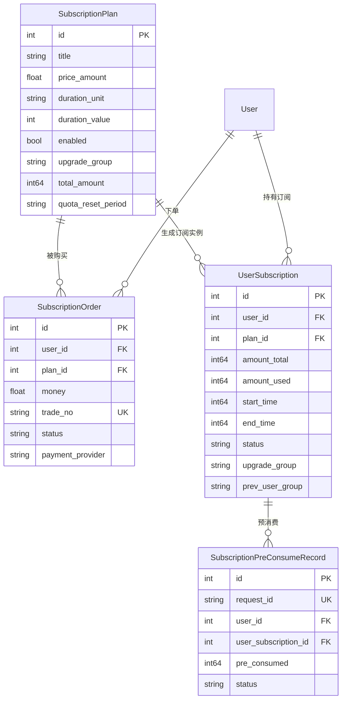

# 数据库模型设计文档 — 订阅套餐

## 基础信息

**模块前缀：** `sub`

**数据库类型：** 关系型数据库（同时兼容 SQLite / MySQL >= 5.7.8 / PostgreSQL >= 9.6）

**主键策略：** 自增整数 ID（由 GORM AutoMigrate 管理）

**迁移方式：** GORM AutoMigrate（禁止手写 SQL 迁移文件）

**公共字段约定：** 所有业务表包含 `deleted_at`（gorm.DeletedAt，软删除标记）、`created_at`（bigint，Unix 时间戳）和 `updated_at`（bigint，Unix 时间戳），通过 GORM Hook 自动维护时间戳。

---

## ER 图



---

## 表结构定义

### 1. 核心业务表

#### 1.1 subscription_plans（订阅套餐表）

**表名：** `subscription_plans`

**用途：** 存储管理员配置的订阅套餐定义，包含价格、时长、额度、重置周期等属性。

---

**DDL 语句（GORM 结构体定义）：**

```go
type SubscriptionPlan struct {
    Id int `json:"id"`

    Title    string `json:"title" gorm:"type:varchar(128);not null"`
    Subtitle string `json:"subtitle" gorm:"type:varchar(255);default:''"`

    PriceAmount float64 `json:"price_amount" gorm:"type:decimal(10,6);not null;default:0"`
    Currency    string  `json:"currency" gorm:"type:varchar(8);not null;default:'USD'"`

    DurationUnit  string `json:"duration_unit" gorm:"type:varchar(16);not null;default:'month'"`
    DurationValue int    `json:"duration_value" gorm:"type:int;not null;default:1"`
    CustomSeconds int64  `json:"custom_seconds" gorm:"type:bigint;not null;default:0"`

    Enabled   bool `json:"enabled" gorm:"default:true"`
    SortOrder int  `json:"sort_order" gorm:"type:int;default:0"`

    StripePriceId  string `json:"stripe_price_id" gorm:"type:varchar(128);default:''"`
    CreemProductId string `json:"creem_product_id" gorm:"type:varchar(128);default:''"`

    MaxPurchasePerUser int `json:"max_purchase_per_user" gorm:"type:int;default:0"`

    UpgradeGroup string `json:"upgrade_group" gorm:"type:varchar(64);default:''"`

    TotalAmount int64 `json:"total_amount" gorm:"type:bigint;not null;default:0"`

    QuotaResetPeriod        string `json:"quota_reset_period" gorm:"type:varchar(16);default:'never'"`
    QuotaResetCustomSeconds int64  `json:"quota_reset_custom_seconds" gorm:"type:bigint;default:0"`

    CreatedAt int64 `json:"created_at" gorm:"bigint"`
    UpdatedAt int64 `json:"updated_at" gorm:"bigint"`
    DeletedAt gorm.DeletedAt `json:"deleted_at" gorm:"index"`
}
```

---

**字段说明：**

| 字段名 | 类型（MySQL） | 类型（PostgreSQL） | 必填 | 默认值 | 说明 |
|--------|-------------|-------------------|------|--------|------|
| id | INT | INTEGER | 是 | 自增 | 主键 ID |
| title | VARCHAR(128) | VARCHAR(128) | 是 | - | 套餐标题 [长度来源：需求规格说明书] |
| subtitle | VARCHAR(255) | VARCHAR(255) | 否 | '' | 套餐副标题 [长度来源：需求规格说明书] |
| price_amount | DECIMAL(10,6) | NUMERIC(10,6) | 是 | 0 | 显示金额，精确到小数点后 6 位 [长度来源：需求规格说明书] |
| currency | VARCHAR(8) | VARCHAR(8) | 是 | 'USD' | 货币类型，当前强制 USD |
| duration_unit | VARCHAR(16) | VARCHAR(16) | 是 | 'month' | 时长单位 [字典：sub_duration_unit] |
| duration_value | INT | INTEGER | 是 | 1 | 时长数值（duration_unit 为 custom 时忽略） |
| custom_seconds | BIGINT | BIGINT | 是 | 0 | 自定义秒数（duration_unit 为 custom 时使用） |
| enabled | BOOLEAN | BOOLEAN | 是 | true | 是否启用 [字典：sub_plan_status] |
| sort_order | INT | INTEGER | 是 | 0 | 排序权重，值越大越靠前 |
| stripe_price_id | VARCHAR(128) | VARCHAR(128) | 否 | '' | Stripe 平台定价 ID [长度来源：需求规格说明书] |
| creem_product_id | VARCHAR(128) | VARCHAR(128) | 否 | '' | Creem 平台产品 ID [长度来源：需求规格说明书] |
| max_purchase_per_user | INT | INTEGER | 是 | 0 | 每用户最大购买次数，0 表示无限制 |
| upgrade_group | VARCHAR(64) | VARCHAR(64) | 否 | '' | 购买后升级到的用户分组 [长度来源：需求规格说明书] |
| total_amount | BIGINT | BIGINT | 是 | 0 | 总额度（额度单位），0 表示无限制 |
| quota_reset_period | VARCHAR(16) | VARCHAR(16) | 是 | 'never' | 配额重置周期 [字典：sub_reset_period] |
| quota_reset_custom_seconds | BIGINT | BIGINT | 是 | 0 | 自定义重置周期秒数（quota_reset_period 为 custom 时使用） |
| created_at | BIGINT | BIGINT | 是 | - | 创建时间（Unix 时间戳） |
| updated_at | BIGINT | BIGINT | 是 | - | 更新时间（Unix 时间戳） |
| deleted_at | DATETIME | TIMESTAMP | 否 | NULL | 软删除时间（GORM 自动管理） |

**索引说明：**

| 索引名 | 类型 | 字段 | 用途 |
|--------|------|------|------|
| PRIMARY | PRIMARY KEY | id | 主键索引 |

**业务规则：**
- title 不能为空字符串（应用层校验）
- price_amount 范围 [0, 9999]（应用层校验）
- upgrade_group 需为系统已存在的有效分组（应用层校验）
- SQLite 下 SubscriptionPlan 使用独立建表逻辑（`ensureSubscriptionPlanTableSQLite`），因为其 AutoMigrate 不支持修改列类型

---

#### 1.2 subscription_orders（订阅订单表）

**表名：** `subscription_orders`

**用途：** 存储用户购买订阅套餐时创建的支付订单，记录交易号、支付方式、支付状态等信息。

---

**DDL 语句（GORM 结构体定义）：**

```go
type SubscriptionOrder struct {
    Id     int     `json:"id"`
    UserId int     `json:"user_id" gorm:"index"`
    PlanId int     `json:"plan_id" gorm:"index"`
    Money  float64 `json:"money"`

    TradeNo         string `json:"trade_no" gorm:"unique;type:varchar(255);index"`
    PaymentMethod   string `json:"payment_method" gorm:"type:varchar(50)"`
    PaymentProvider string `json:"payment_provider" gorm:"type:varchar(50);default:''"`
    Status          string `json:"status"`
    CreateTime      int64  `json:"create_time"`
    CompleteTime    int64  `json:"complete_time"`

    ProviderPayload string `json:"provider_payload" gorm:"type:text"`

    DeletedAt gorm.DeletedAt `json:"deleted_at" gorm:"index"`
}
```

---

**字段说明：**

| 字段名 | 类型（MySQL） | 类型（PostgreSQL） | 必填 | 默认值 | 说明 |
|--------|-------------|-------------------|------|--------|------|
| id | INT | INTEGER | 是 | 自增 | 主键 ID |
| user_id | INT | INTEGER | 是 | - | 下单用户 ID |
| plan_id | INT | INTEGER | 是 | - | 购买的套餐 ID |
| money | DOUBLE | DOUBLE PRECISION | 是 | - | 订单金额 |
| trade_no | VARCHAR(255) | VARCHAR(255) | 是 | - | 交易号，全局唯一 [字典：sub_order_status] |
| payment_method | VARCHAR(50) | VARCHAR(50) | 否 | - | 支付方式（如 alipay、stripe 等） |
| payment_provider | VARCHAR(50) | VARCHAR(50) | 否 | '' | 支付提供商 [字典：sub_payment_provider] |
| status | VARCHAR(32) | VARCHAR(32) | 是 | - | 订单状态 [字典：sub_order_status] |
| create_time | BIGINT | BIGINT | 是 | - | 创建时间（Unix 时间戳） |
| complete_time | BIGINT | BIGINT | 否 | 0 | 完成时间（Unix 时间戳） |
| provider_payload | TEXT | TEXT | 否 | - | 支付提供商返回的原始数据 |
| deleted_at | DATETIME | TIMESTAMP | 否 | NULL | 软删除时间（GORM 自动管理） |

**索引说明：**

| 索引名 | 类型 | 字段 | 用途 |
|--------|------|------|------|
| PRIMARY | PRIMARY KEY | id | 主键索引 |
| idx_subscription_orders_user_id | INDEX | user_id | 按用户查询订单 |
| idx_subscription_orders_plan_id | INDEX | plan_id | 按套餐查询订单 |
| idx_subscription_orders_trade_no | UNIQUE | trade_no | 交易号唯一约束 + 查询 |

**业务规则：**
- 订单状态流转：pending -> success / expired（终态）
- 支付回调通过 `FOR UPDATE` 行锁 + `expectedPaymentProvider` 防止跨网关攻击
- 支付成功后幂等创建 UserSubscription

---

#### 1.3 user_subscriptions（用户订阅实例表）

**表名：** `user_subscriptions`

**用途：** 存储用户的订阅实例，记录额度使用、有效期、状态、分组升降级信息。

---

**DDL 语句（GORM 结构体定义）：**

```go
type UserSubscription struct {
    Id     int `json:"id"`
    UserId int `json:"user_id" gorm:"index;index:idx_user_sub_active,priority:1"`
    PlanId int `json:"plan_id" gorm:"index"`

    AmountTotal int64 `json:"amount_total" gorm:"type:bigint;not null;default:0"`
    AmountUsed  int64 `json:"amount_used" gorm:"type:bigint;not null;default:0"`

    StartTime int64  `json:"start_time" gorm:"bigint"`
    EndTime   int64  `json:"end_time" gorm:"bigint;index;index:idx_user_sub_active,priority:3"`
    Status    string `json:"status" gorm:"type:varchar(32);index;index:idx_user_sub_active,priority:2"`

    Source string `json:"source" gorm:"type:varchar(32);default:'order'"`

    LastResetTime int64 `json:"last_reset_time" gorm:"type:bigint;default:0"`
    NextResetTime int64 `json:"next_reset_time" gorm:"type:bigint;default:0;index"`

    UpgradeGroup  string `json:"upgrade_group" gorm:"type:varchar(64);default:''"`
    PrevUserGroup string `json:"prev_user_group" gorm:"type:varchar(64);default:''"`

    CreatedAt int64 `json:"created_at" gorm:"bigint"`
    UpdatedAt int64 `json:"updated_at" gorm:"bigint"`
    DeletedAt gorm.DeletedAt `json:"deleted_at" gorm:"index"`
}
```

---

**字段说明：**

| 字段名 | 类型（MySQL） | 类型（PostgreSQL） | 必填 | 默认值 | 说明 |
|--------|-------------|-------------------|------|--------|------|
| id | INT | INTEGER | 是 | 自增 | 主键 ID |
| user_id | INT | INTEGER | 是 | - | 所属用户 ID |
| plan_id | INT | INTEGER | 是 | - | 关联的套餐 ID |
| amount_total | BIGINT | BIGINT | 是 | 0 | 总额度，0 表示无限制 |
| amount_used | BIGINT | BIGINT | 是 | 0 | 已使用额度 |
| start_time | BIGINT | BIGINT | 是 | - | 订阅开始时间（Unix 时间戳） |
| end_time | BIGINT | BIGINT | 是 | - | 订阅结束时间（Unix 时间戳） |
| status | VARCHAR(32) | VARCHAR(32) | 是 | - | 订阅状态 [字典：sub_subscription_status] |
| source | VARCHAR(32) | VARCHAR(32) | 是 | 'order' | 来源 [字典：sub_subscription_source] |
| last_reset_time | BIGINT | BIGINT | 是 | 0 | 上次配额重置时间（Unix 时间戳） |
| next_reset_time | BIGINT | BIGINT | 是 | 0 | 下次配额重置时间（Unix 时间戳），0 表示不重置 |
| upgrade_group | VARCHAR(64) | VARCHAR(64) | 否 | '' | 升级后的用户分组 |
| prev_user_group | VARCHAR(64) | VARCHAR(64) | 否 | '' | 升级前的原始分组（用于降级回退） |
| created_at | BIGINT | BIGINT | 是 | - | 创建时间（Unix 时间戳） |
| updated_at | BIGINT | BIGINT | 是 | - | 更新时间（Unix 时间戳） |
| deleted_at | DATETIME | TIMESTAMP | 否 | NULL | 软删除时间（GORM 自动管理） |

**索引说明：**

| 索引名 | 类型 | 字段 | 用途 |
|--------|------|------|------|
| PRIMARY | PRIMARY KEY | id | 主键索引 |
| idx_user_subscriptions_user_id | INDEX | user_id | 按用户查询订阅 |
| idx_user_subscriptions_plan_id | INDEX | plan_id | 按套餐查询订阅 |
| idx_user_subscriptions_status | INDEX | status | 按状态查询（过期扫描） |
| idx_user_subscriptions_end_time | INDEX | end_time | 按结束时间查询（过期扫描） |
| idx_user_subscriptions_next_reset_time | INDEX | next_reset_time | 配额重置扫描 |
| idx_user_sub_active | COMPOSITE | user_id, status, end_time | 活跃订阅查询（预消费、过期处理） |

**业务规则：**
- 状态流转：active -> expired（定时任务）/ cancelled（管理员作废）
- 过期处理：定时任务每分钟扫描 `status=active AND end_time<=now`
- 分组降级：过期或作废时，仅当用户当前分组 == upgrade_group 且无其他活跃升级订阅时才回退
- 预消费：按 `end_time asc, id asc` 顺序消耗最早到期的活跃订阅

---

#### 1.4 subscription_pre_consume_records（订阅预消费记录表）

**表名：** `subscription_pre_consume_records`

**用途：** 存储每次 API 请求的订阅预消费记录，通过 request_id 保证幂等，支持预扣、结算、退款操作。

---

**DDL 语句（GORM 结构体定义）：**

```go
type SubscriptionPreConsumeRecord struct {
    Id                 int    `json:"id"`
    RequestId          string `json:"request_id" gorm:"type:varchar(64);uniqueIndex"`
    UserId             int    `json:"user_id" gorm:"index"`
    UserSubscriptionId int    `json:"user_subscription_id" gorm:"index"`
    PreConsumed        int64  `json:"pre_consumed" gorm:"type:bigint;not null;default:0"`
    Status             string `json:"status" gorm:"type:varchar(32);index"`
    CreatedAt          int64  `json:"created_at" gorm:"bigint"`
    UpdatedAt          int64  `json:"updated_at" gorm:"bigint;index"`
    DeletedAt          gorm.DeletedAt `json:"deleted_at" gorm:"index"`
}
```

---

**字段说明：**

| 字段名 | 类型（MySQL） | 类型（PostgreSQL） | 必填 | 默认值 | 说明 |
|--------|-------------|-------------------|------|--------|------|
| id | INT | INTEGER | 是 | 自增 | 主键 ID |
| request_id | VARCHAR(64) | VARCHAR(64) | 是 | - | 请求 ID（幂等键），全局唯一 |
| user_id | INT | INTEGER | 是 | - | 用户 ID |
| user_subscription_id | INT | INTEGER | 是 | - | 关联的用户订阅实例 ID |
| pre_consumed | BIGINT | BIGINT | 是 | 0 | 预消费额度 |
| status | VARCHAR(32) | VARCHAR(32) | 是 | - | 状态 [字典：sub_pre_consume_status] |
| created_at | BIGINT | BIGINT | 是 | - | 创建时间（Unix 时间戳） |
| updated_at | BIGINT | BIGINT | 是 | - | 更新时间（Unix 时间戳） |
| deleted_at | DATETIME | TIMESTAMP | 否 | NULL | 软删除时间（GORM 自动管理） |

**索引说明：**

| 索引名 | 类型 | 字段 | 用途 |
|--------|------|------|------|
| PRIMARY | PRIMARY KEY | id | 主键索引 |
| idx_request_id | UNIQUE | request_id | 幂等性保证 |
| idx_user_id | INDEX | user_id | 按用户查询 |
| idx_user_subscription_id | INDEX | user_subscription_id | 按订阅实例查询 |
| idx_status | INDEX | status | 按状态查询 |
| idx_updated_at | INDEX | updated_at | 清理过期记录 |

**业务规则：**
- request_id 唯一索引保证预消费幂等
- 已 refunded 的记录不允许再次操作
- 定期清理 7 天前的记录（`CleanupSubscriptionPreConsumeRecords`）

---

## 字典数据

### 字典类型和数据

#### sub_duration_unit（订阅时长单位）

| 字典值 | 说明 |
|--------|------|
| year | 年 |
| month | 月 |
| day | 天 |
| hour | 小时 |
| custom | 自定义（秒） |

#### sub_reset_period（配额重置周期）

| 字典值 | 说明 |
|--------|------|
| never | 不重置 |
| daily | 每天重置 |
| weekly | 每周重置 |
| monthly | 每月重置 |
| custom | 自定义（秒） |

#### sub_plan_status（套餐状态）

| 字典值 | 说明 |
|--------|------|
| true | 启用 |
| false | 禁用 |

#### sub_order_status（订单状态）

| 字典值 | 说明 |
|--------|------|
| pending | 待支付 |
| success | 支付成功 |
| expired | 已过期 |

#### sub_subscription_status（订阅状态）

| 字典值 | 说明 |
|--------|------|
| active | 活跃 |
| expired | 已过期 |
| cancelled | 已作废 |

#### sub_subscription_source（订阅来源）

| 字典值 | 说明 |
|--------|------|
| order | 支付购买 |
| admin | 管理员绑定 |

#### sub_payment_provider（支付提供商）

| 字典值 | 说明 |
|--------|------|
| stripe | Stripe |
| creem | Creem |
| epay | 易支付 |

#### sub_pre_consume_status（预消费状态）

| 字典值 | 说明 |
|--------|------|
| consumed | 已消费 |
| refunded | 已退款 |

---

## 用户计费偏好存储

用户的计费偏好（`billing_preference`）存储在现有 `users` 表的 `billing_preference` 字段中（VARCHAR(32)，默认值 `subscription_first`）。该字段在订阅套餐功能中新增，通过 GORM AutoMigrate 自动添加。

可选值与 specs 定义一致：`subscription_first`、`wallet_first`、`subscription_only`、`wallet_only`。

---

## 缓存策略

### 订阅套餐缓存

**缓存实现：** `cachex.HybridCache`（Redis + 内存 LRU 双层缓存）

| 缓存项 | Redis Key 前缀 | 内存容量 | TTL | 清除时机 |
|--------|---------------|---------|-----|---------|
| 套餐详情 | `new-api:subscription_plan:v1` | 5000 | 300s | 套餐创建/更新/启用禁用 |
| 套餐信息（ID+标题） | `new-api:subscription_plan_info:v1` | 10000 | 120s | 套餐创建/更新/启用禁用（全量清除） |

**容量和环境变量：**
- `SUBSCRIPTION_PLAN_CACHE_TTL`：套餐缓存 TTL（默认 300s）
- `SUBSCRIPTION_PLAN_CACHE_CAP`：套餐缓存容量（默认 5000）
- `SUBSCRIPTION_PLAN_INFO_CACHE_TTL`：套餐信息缓存 TTL（默认 120s）
- `SUBSCRIPTION_PLAN_INFO_CACHE_CAP`：套餐信息缓存容量（默认 10000）

### 用户分组缓存

订阅创建（升级）和取消/过期（降级）时，通过 `UpdateUserGroupCache` 同步更新用户分组缓存。

---

## 性能优化

### 批量处理

- 过期订阅扫描：每批最多处理 `limit` 条（默认 200）
- 配额重置扫描：每批最多处理 `limit` 条（默认 200）
- 预消费记录清理：每 30 分钟执行，清理 7 天前的记录

### 并发控制

- 订单完成：`FOR UPDATE` 行锁 + 订单号分布式锁
- 预消费：`FOR UPDATE` 行锁 + request_id 唯一索引双重保证幂等
- 分组降级：事务内查询用户当前分组，仅匹配时才执行降级

### 索引设计

- `idx_user_sub_active` 复合索引覆盖活跃订阅查询（预消费、过期处理的核心查询路径）
- `idx_next_reset_time` 支持配额重置定时任务的高效扫描

---

**文档版本：** v1.0

**最后更新：** 2026-05-17

**作者：** lixuetao
